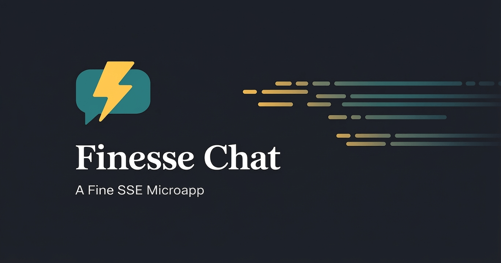

# Finesse Chat

A microapp built to demonstrate the practical differences between Polling, WebSockets, and Server-Sent Events. Built with Rails 8, Hotwire, and the [Finesse](https://github.com/scudco/finesse) gem.

---



---

## Three Transports

- **Polling** — a fetch every 7.77 seconds to get the latest messages. The simplest approach to updating data. Very reliable, but definitely not real-time. In this app, Polling is not used as a fallback for WebSockets or SSE so that those features' limitations are more clear. In a real app, you'd likely want polling always on to sync to server state
- **WebSockets** — via SolidCable, available in Rails 8 without any real configuration needed. More finicky when dealing with ordered data and reconnects. The fastest but least reliable transport in testing
- **Server-Sent Events** — a long-lived HTTP connection that browsers work well with by default. This app demonstrates its reliability and speed compared to WebSockets

## Bot Storm

The Bot Storm button fires a burst of messages from bots to demonstrate how each transport handles message flooding. When using WebSockets, you can expect to see messages tagged with an **OUT OF ORDER** badge — demonstrating that WebSocket messages have a decent potential of being received out of order.

## Things To Know

- The chat resets every five minutes — the channel name rotates on each reset
- Most markdown is supported — **bold**, `code`, *italic*, and more
- Press `↑` in the empty input to edit your last message
- Hover one of your messages to reveal edit/delete controls
- Click the ↺ icon next to your username to get a new random username

## Slash Commands

| Command | Description |
|---|---|
| `/help` | Show a list of commands in chat |
| `/time` | Post the current server time |
| `/meow`, `/🐱` | Thanks for signing up for Cat Facts! |
| `/woof`, `/🐶` | Dog Facts for the refined factician |
| `/wut <acronym>` | Expand a tech acronym |
| `/me <action>` | Post a third-person action |

## Development

```bash
bin/setup
bin/dev
```

`bin/dev` runs Rails, the Tailwind watcher, the Finesse SSE server, and SolidQueue via `Procfile.dev`.

## Tests

```bash
bin/rails test          # unit + integration
bin/rails test:system   # system tests (headless Chrome)
bin/rubocop             # linting
```

CI runs all three on every pull request via GitHub Actions. Run `bin/ci` locally before pushing to catch issues early. To wire it up as a git hook:

```bash
echo -e '#!/usr/bin/env bash\nset -e\nbin/ci' > .git/hooks/pre-push && chmod +x .git/hooks/pre-push
```

## Credits

- `db/wordlist.txt` — [Oren Tirosh's mnemonic encoding wordlist](https://web.archive.org/web/20101031205747/http://www.tothink.com/mnemonic/), via [singpolyma/mnemonicode](https://github.com/singpolyma/mnemonicode)
- `db/catfacts.txt` — [catfact.ninja](https://catfact.ninja/)
- `db/dogfacts.txt` — [Dog API by kinduff](https://dogapi.dog/)
- `db/acronyms.tsv` — [NetBSD `wtf(6)` acronyms database](https://man.netbsd.org/wtf.6)
