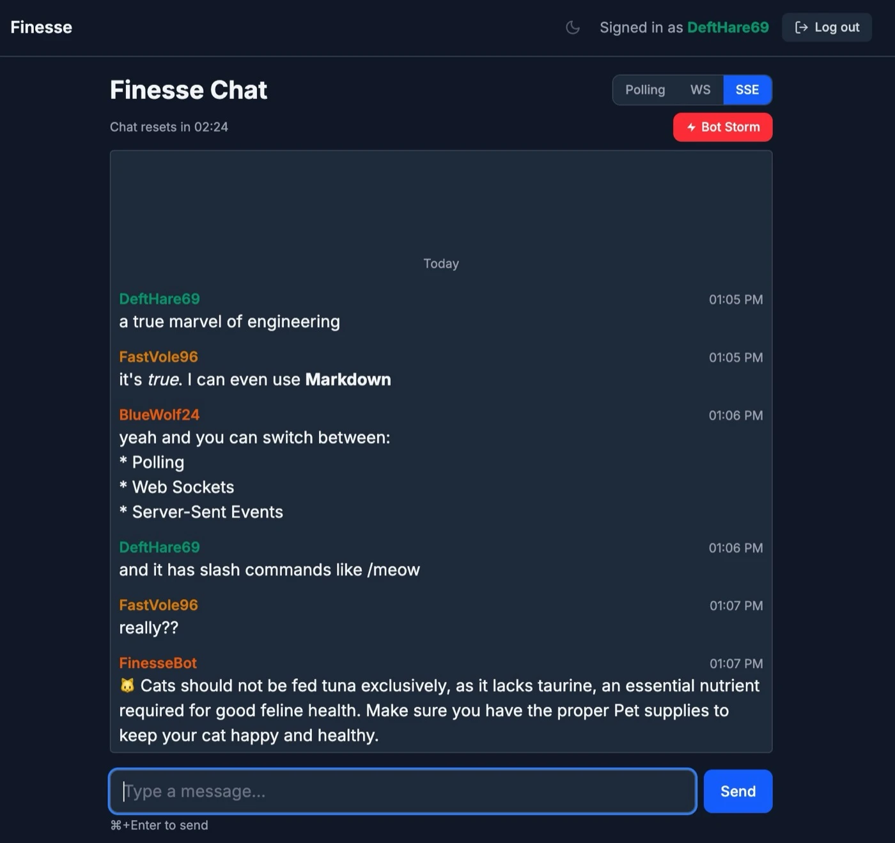

# Finesse

A real-time group chat demo built with Rails 8. The focus is on exploring modern Rails primitives — Hotwire, SolidQueue, SolidCable — with no JavaScript framework and no Redis.

---



---

## Stack

- **Ruby 4.0 / Rails 8.1** on Puma
- **SQLite** for all persistence — primary DB, job queue, Action Cable backend, and cache
- **Hotwire** (Turbo Streams + Stimulus) for all interactivity
- **Tailwind CSS v4** for styling
- **Go** for an optional SSE server (`bin/sse-server`)

## Features

- **Three real-time transports**, switchable at runtime: WebSocket (Action Cable via SolidCable), Server-Sent Events (custom Go server polling SQLite at 10ms), and long-poll fallback
- **SolidQueue** powers background jobs and a recurring clear schedule — no Redis, no Sidekiq
- **Markdown rendering** via Redcarpet with a custom renderer — fenced code blocks, inline formatting, blockquotes, and safe link handling
- **Slash commands** (`/time`, `/meow`, `/wtf <acronym>`, `/me`) handled asynchronously by a bot job; commands never echo the user's input
- **Inline message editing and deletion** scoped to the current session, with focus and scroll management handled in Stimulus
- **Dark/light/system theme** with localStorage persistence and an anti-flash inline script in `<head>`
- **Automatic chat clearing** every 5 minutes via SolidQueue recurring job, broadcasting the empty state to all connected clients
- **iOS Safari bfcache** handled via the `pageshow` + `persisted` event to prevent stale message views
- **Bot Storm** enqueues a SolidQueue job that creates 100 messages in rapid succession — useful for stress-testing transport throughput, verifying scroll behaviour under load, and observing how each transport (WS, SSE, polling) handles a burst of events. Rate-limited to one active storm at a time.

## Development

```bash
bin/setup
bin/dev
```

`bin/dev` runs Rails, the Tailwind watcher, the Go SSE server, and SolidQueue via `Procfile.dev`.

## Tests

```bash
bin/rails test          # unit + integration
bin/rails test:system   # system tests (headless Chrome)
bin/rubocop             # linting
```

CI runs all three on every pull request via GitHub Actions.
